<div align="center" id="trendradar">

<a href="https://github.com/sansan0/TrendRadar" title="TrendRadar">
  
</a>

🚀 Deploy in <strong>30 seconds</strong> — Your Smart Trending News Assistant

<a href="https://trendshift.io/repositories/14726" target="_blank"></a>

<a href="https://share.302.ai/mEOUzG" target="_blank"></a>

[](https://github.com/sansan0/TrendRadar/stargazers)
[](https://github.com/sansan0/TrendRadar/network/members)
[](LICENSE)
[](https://github.com/sansan0/TrendRadar)
[](https://github.com/sansan0/TrendRadar)

[](https://work.weixin.qq.com/)
[](https://weixin.qq.com/)
[](https://telegram.org/)
[](#)
[](https://www.feishu.cn/)
[](#)
[](https://github.com/binwiederhier/ntfy)


[](https://github.com/sansan0/TrendRadar)
[](https://sansan0.github.io/TrendRadar)
[](https://hub.docker.com/r/wantcat/trendradar)
[](https://modelcontextprotocol.io/)

</div>

<div align="center">

**[中文](README.md)** | **English**

</div>


> This project is designed to be lightweight and easy to deploy

## 📑 Quick Navigation

<div align="center">

| [🎯 Core Features](#-core-features) | [🚀 Quick Start](#-quick-start) | [⚙️ Configuration Guide](#-configuration-guide) | [🐳 Docker Deployment](#-docker-deployment) |
|:---:|:---:|:---:|:---:|
| [🤖 AI Analysis](#-ai-analysis) | [🔌 MCP Clients](#-mcp-clients) | [📝 Changelog](#-changelog) | [❓ FAQ & Support](#-faq--support) |
| [⭐ Related Projects](#-related-projects) | [🪄 Sponsors](#-sponsors) | | |

</div>

- Thanks to **bug reporters**, your feedback makes this project better 😉
- Thanks to **stargazers**, your stars and forks are the best support for open source 😍
- Thanks to **followers**, your interactions make the content more meaningful 😎

<details>
<summary>👉 Click to view <strong>Acknowledgments</strong> (Current <strong>🔥72🔥</strong> supporters)</summary>

### Infrastructure Support

Thanks to **GitHub** for providing free infrastructure, which is the biggest prerequisite for this project to run conveniently with **one-click fork**.

### Data Support

This project uses the API from [newsnow](https://github.com/ourongxing/newsnow) to fetch multi-platform data. Special thanks to the author for providing this service.

After communication, the author indicated no concerns about server pressure, but this is based on their goodwill and trust. Please everyone:
- **Visit the [newsnow project](https://github.com/ourongxing/newsnow) and give it a star**
- When deploying with Docker, please control the frequency reasonably and avoid being overly greedy

### Promotion Support

> Thanks to the following platforms and individuals for recommendations (in chronological order)

- [Appinn (小众软件)](https://mp.weixin.qq.com/s/fvutkJ_NPUelSW9OGK39aA) - Open source software recommendation platform
- [LinuxDo Community](https://linux.do/) - Tech enthusiasts community
- [Ruan Yifeng's Weekly](https://github.com/ruanyf/weekly) - Influential tech weekly in Chinese tech circle

### Community Support

> Thanks to **financial supporters**. Your generosity has transformed into snacks and drinks beside my keyboard, accompanying every iteration of this project
>
> **"One-yuan appreciation"** has been suspended. If you still want to support the author, please visit the [official account](#-faq--support) article and click "Like Author" at the bottom.

| Supporter | Amount (CNY) | Date | Note |
| :-------: | :----------: | :--: | :--: |
| *鬼 | 1 | 2025.11.17 | |
| *超 | 10 | 2025.11.17 | |
| R*w | 10 | 2025.11.17 | Great agent work! |
| J*o | 1 | 2025.11.17 | Thanks for open source |
| *晨 | 8.88 | 2025.11.16 | Nice project |
| *海 | 1 | 2025.11.15 | |
| *德 | 1.99 | 2025.11.15 | |
| *疏 | 8.8 | 2025.11.14 | Great project |
| M*e | 10 | 2025.11.14 | Open source is not easy |
| **柯 | 1 | 2025.11.14 | |
| *云 | 88 | 2025.11.13 | Good project |
| *W | 6 | 2025.11.13 | |
| *凯 | 1 | 2025.11.13 | |
| 对*. | 1 | 2025.11.13 | Thanks for TrendRadar |
| s*y | 1 | 2025.11.13 | |
| **翔 | 10 | 2025.11.13 | Wish I found it earlier |
| *韦 | 9.9 | 2025.11.13 | TrendRadar is awesome |
| h*p | 5 | 2025.11.12 | Support Chinese open source |
| c*r | 6 | 2025.11.12 | |
| a*n | 5 | 2025.11.12 | |
| 。*c | 1 | 2025.11.12 | Thanks for sharing |
| ... | ... | ... | **(More 50+ supporters)** |

</details>


## ✨ Core Features

### **Multi-Platform Trending News Aggregation**

- Zhihu (知乎)
- Douyin (抖音)
- Bilibili Hot Search
- Wallstreetcn (华尔街见闻)
- Tieba (贴吧)
- Baidu Hot Search
- Yicai (财联社)
- Thepaper (澎湃新闻)
- Ifeng (凤凰网)
- Toutiao (今日头条)
- Weibo (微博)

Default monitoring of 11 mainstream platforms, with support for adding custom platforms.

> 💡 For detailed configuration, see [Configuration Guide - Platform Configuration](#1-platform-configuration)

### **Smart Push Strategies**

**Three Push Modes**:

| Mode | Target Users | Push Feature |
|------|--------------|--------------|
| **Daily Summary** (daily) | Managers/Regular Users | Push all matched news of the day (includes previously pushed) |
| **Current Rankings** (current) | Content Creators | Push current ranking matches (continuously ranked news appear each time) |
| **Incremental Monitor** (incremental) | Traders/Investors | Push only new content, zero duplication |

> 💡 **Quick Selection Guide:**
> - 🔄 Don't want duplicate news → Use `incremental`
> - 📊 Want complete ranking trends → Use `current`
> - 📝 Need daily summary reports → Use `daily`
>
> For detailed comparison and configuration, see [Configuration Guide - Push Mode Details](#3-push-mode-details)

**Additional Feature - Push Time Window Control** (Optional):

- Set push time range (e.g., 09:00-18:00), push only within specified time
- Configure multiple pushes within window or once per day
- Avoid notifications during non-work hours

> 💡 This feature is disabled by default, see [Quick Start](#-quick-start) for configuration

### **Precise Content Filtering**

Set personal keywords (e.g., AI, BYD, Education Policy) to receive only relevant trending news, filtering out noise.

- Supports normal words, required words (+), and filter words (!)
- Group-based management with independent statistics for different topics

> 💡 Keyword configuration tutorial: [Configuration Guide - Keyword Configuration](#2-keyword-configuration)
> 💡 You can also skip filtering and receive all trending news (leave frequency_words.txt empty)


### **Trending Analysis**

Real-time tracking of news popularity changes helps you understand not just "what's trending" but "how trends evolve."

- **Timeline Tracking**: Records complete time span from first to last appearance
- **Popularity Changes**: Tracks ranking changes and appearance frequency across time periods
- **New Detection**: Real-time identification of emerging topics, marked with 🆕
- **Continuity Analysis**: Distinguishes between one-time hot topics and continuously developing news
- **Cross-Platform Comparison**: Same news across different platforms, showing media attention differences

> 💡 Push format reference: [Configuration Guide - Push Format Reference](#5-push-format-reference)

### **Personalized Trending Algorithm**

No longer controlled by platform algorithms, TrendRadar reorganizes all trending searches:

- **Prioritize High-Ranking News** (60%): Top-ranked news from each platform appears first
- **Focus on Persistent Topics** (30%): Repeatedly appearing news is more important
- **Consider Ranking Quality** (10%): Not just frequent, but consistently top-ranked

> 💡 Weight adjustment guide: [Configuration Guide - Advanced Configuration](#4-advanced-configuration---hotspot-weight-adjustment)

### **Multi-Channel Real-Time Push**

Supports **WeWork** (+ WeChat push solution), **Feishu**, **DingTalk**, **Telegram**, **Email**, **ntfy** — messages delivered directly to phone and email.

### **Multi-Platform Support**
- **GitHub Pages**: Auto-generate beautiful web reports, PC/mobile adapted
- **Docker Deployment**: Supports multi-architecture containerized operation
- **Data Persistence**: HTML/TXT multi-format history saving


### **AI Smart Analysis (v3.0.0 New)**

AI conversational analysis system based on MCP (Model Context Protocol), enabling deep data mining with natural language.

- **Conversational Query**: Ask in natural language, like "Query yesterday's Zhihu trending" or "Analyze recent Bitcoin popularity trends"
- **13 Analysis Tools**: Basic query, smart search, trend analysis, data insights, sentiment analysis, etc.
- **Multi-Client Support**: Cherry Studio (GUI config), Claude Desktop, Cursor, Cline, etc.
- **Deep Analysis Capabilities**:
  - Topic trend tracking (popularity changes, lifecycle, viral detection, trend prediction)
  - Cross-platform data comparison (activity stats, keyword co-occurrence)
  - Smart summary generation, similar news finding, historical correlation search

> **💡 Usage Tip**: AI features require local news data support
> - Project includes **November 1-15** test data for immediate experience
> - Recommend deploying the project yourself to get more real-time data
>
> See [AI Analysis](#-ai-analysis) for details

### **Zero Technical Barrier Deployment**

One-click GitHub Fork to use, no programming required.

> 30-second deployment: GitHub Pages (web browsing) supports one-click save as image for easy sharing
>
> 1-minute deployment: WeWork (mobile notification)

**💡 Tip:** Want a **real-time updated** web version? After forking, go to your repo Settings → Pages and enable GitHub Pages. [Preview Effect](https://sansan0.github.io/TrendRadar/).

### **Reduce APP Dependencies**

Transform from "algorithm recommendation captivity" to "actively getting the information you want"

**Target Users:** Investors, content creators, PR professionals, news-conscious general users

**Typical Scenarios:** Stock investment monitoring, brand sentiment tracking, industry trend watching, lifestyle news gathering


| Github Pages Effect (Mobile Adapted, Email Push) | Feishu Push Effect |
|:---:|:---:|
|  |  |


## 📝 Changelog

>**Upgrade Instructions**:
- **Tip**: Do NOT update this project via **Sync fork**. Check [Changelog](#changelog) to understand specific [Upgrade Methods] and [Features]
- **Minor Version Update**: Upgrading from v2.x to v2.y, replace `main.py` in your forked repo with the latest version
- **Major Version Upgrade**: Upgrading from v1.x to v2.y, recommend deleting existing fork and re-forking to save effort and avoid config conflicts


### 2025/11/20 - v3.1.0

- **Added Personal WeChat Push Support**: WeWork application can push to personal WeChat without installing WeWork APP
- Supports two message formats: `markdown` (WeWork group bot) and `text` (personal WeChat app)
- Added `WEWORK_MSG_TYPE` environment variable configuration, supporting GitHub Actions, Docker, docker-compose and other deployment methods
- `text` mode automatically strips Markdown syntax for clean plain text push
- See "Personal WeChat Push" configuration in Quick Start

**Upgrade Instructions** (GitHub Fork Users):
- Required updates: `main.py`, `config/config.yaml`
- Optional update: `.github/workflows/crawler.yml` (if using GitHub Actions)
- Recommended: Use minor version upgrade method - copy and replace the files above


### 2025/11/18 - mcp-v1.0.2

  **MCP Module Update:**
  - Fix issue where today's news query may return articles from past dates


<details>
<summary><strong>👉 Click to expand: Historical Updates</strong></summary>

### 2025/11/12 - v3.0.5

- Fixed email sending SSL/TLS port configuration logic error
- Optimized email service providers (QQ/163/126) to default use port 465 (SSL)
- **Added Docker environment variable support**: Core config items (`enable_crawler`, `report_mode`, `push_window`, etc.) support override via environment variables, solving config file modification issues for NAS users (see [🐳 Docker Deployment](#-docker-deployment) chapter)


### 2025/10/26 - mcp-v1.0.1

  **MCP Module Update:**
  - Fixed date query parameter passing error
  - Unified time parameter format for all tools


### 2025/10/31 - v3.0.4

- Solved Feishu error due to overly long push content, implemented batch pushing


### 2025/10/23 - v3.0.3

- Expanded ntfy error message display range


### 2025/10/21 - v3.0.2

- Fixed ntfy push encoding issue

### 2025/10/20 - v3.0.0

**Major Update - AI Analysis Feature Launched** 🤖

- **Core Features**:
  - New MCP (Model Context Protocol) based AI analysis server
  - 13 smart analysis tools: basic query, smart search, advanced analysis, system management
  - Natural language interaction: Query and analyze news data through conversation
  - Multi-client support: Claude Desktop, Cherry Studio, Cursor, Cline, etc.

- **Analysis Capabilities**:
  - Topic trend analysis (popularity tracking, lifecycle, viral detection, trend prediction)
  - Data insights (platform comparison, activity stats, keyword co-occurrence)
  - Sentiment analysis, similar news finding, smart summary generation
  - Historical related news search, multi-mode search

- **Update Note**:
  - This is an independent AI analysis feature, does not affect existing push functionality
  - Optional use, no need to upgrade existing deployment


### 2025/10/15 - v2.4.4

- **Updates**:
  - Fixed ntfy push encoding issue + 1
  - Fixed push time window judgment issue

- **Upgrade Note**:
  - Recommended minor version upgrade


### 2025/10/10 - v2.4.3

> Thanks to [nidaye996](https://github.com/sansan0/TrendRadar/issues/98) for discovering the UX issue

- **Updates**:
  - Refactored "Silent Push Mode" naming to "Push Time Window Control", improving feature comprehension
  - Clarified push time window as optional additional feature, can work with three push modes
  - Improved comments and documentation, making feature positioning clearer

- **Upgrade Note**:
  - This is just refactoring, upgrade optional


### 2025/10/8 - v2.4.2

- **Updates**:
  - Fixed ntfy push encoding issue
  - Fixed missing config file issue
  - Optimized ntfy push effect
  - Added GitHub Pages image segmented export feature

- **Upgrade Note**:
  - Recommend major version update


### 2025/10/2 - v2.4.0

**Added ntfy Push Notification**

- **Core Features**:
  - Supports ntfy.sh public service and self-hosted servers

- **Use Cases**:
  - Suitable for privacy-conscious users (supports self-hosting)
  - Cross-platform push (iOS, Android, Desktop, Web)
  - No account registration needed (public servers)
  - Open-source and free (MIT License)

- **Upgrade Note**:
  - Recommend major version update


### 2025/09/26 - v2.3.2

- Fixed email notification config check being missed ([#88](https://github.com/sansan0/TrendRadar/issues/88))

**Fix Description**:
- Solved the issue where system still prompted "No webhook configured" even with correct email notification setup


### 2025/09/22 - v2.3.1

- **Added email push feature**, supports sending trending news reports to email
- **Smart SMTP Recognition**: Auto-detects Gmail, QQ Mail, Outlook, NetEase Mail and 10+ email service providers
- **Beautiful HTML Format**: Email content uses same HTML format as web version, well-formatted, mobile-adapted
- **Batch Sending Support**: Supports multiple recipients, separated by commas
- **Custom SMTP**: Can customize SMTP server and port
- Fixed Docker build network connection issue

**Usage Notes**:
- Use cases: Suitable for users needing email archiving, team sharing, scheduled reports
- Supported emails: Gmail, QQ Mail, Outlook/Hotmail, 163/126 Mail, Sina Mail, Sohu Mail, etc.

**Upgrade Note**:
- This update has many changes, if upgrading, recommend major version upgrade


### 2025/09/17 - v2.2.0

- Added one-click save news as image feature, easily share trending topics you care about

**Usage Notes**:
- Use case: After enabling web version feature (GitHub Pages)
- How to use: Open webpage on phone or PC, click "Save as Image" button at top
- Actual effect: System auto-creates beautiful image of current news report, saves to phone album or desktop
- Sharing convenience: Directly send this image to friends, Moments, or work groups, letting others see your discovered important info


### 2025/09/13 - v2.1.2

- Solved DingTalk push capacity limit causing news push failure (using batch push)


### 2025/09/04 - v2.1.1

- Fixed Docker unable to run properly on certain architectures
- Officially released official Docker image wantcat/trendradar, supports multi-architecture
- Optimized Docker deployment process, can use quickly without local build


### 2025/08/30 - v2.1.0

**Core Improvements**:
- **Push Logic Optimization**: Changed from "push every execution" to "controllable push within time window"
- **Time Window Control**: Can set push time range, avoid non-work hour disturbance
- **Push Frequency Options**: Supports single push or multiple pushes within time window

**Upgrade Note**:
- This feature is disabled by default, need to manually enable push time window control in config.yaml
- Upgrade requires updating both main.py and config.yaml files


### 2025/08/27 - v2.0.4

- This version is not a bug fix, but an important reminder
- Please keep webhooks properly, do not make public, do not make public, do not make public
- If you deployed this project on GitHub via fork, please put webhooks in GitHub Secret, not config.yaml
- If you already exposed webhooks or put them in config.yaml, suggest deleting and regenerating


### 2025/08/06 - v2.0.3

- Optimized GitHub Pages web version effect, convenient for mobile use


### 2025/07/28 - v2.0.2

- Refactored code
- Solved version number easily being missed for modification


### 2025/07/27 - v2.0.1

**Fixed Issues**:

1. Docker shell script line ending as CRLF causing execution exception issue
2. frequency_words.txt being empty causing news sending also empty logic issue
  - After fix, when you choose frequency_words.txt empty, will **push all news**, but limited by message push size, please adjust as follows
    - Option 1: Turn off mobile push, only choose GitHub Pages deployment (this is the way to get most complete info, will re-sort all platform trending by your **custom trending algorithm**)
    - Option 2: Reduce push platforms, prioritize **WeWork** or **Telegram**, these two pushes I made batch push feature (because batch push affects push experience, and only these two platforms give very little push capacity, so had to make batch push feature, but at least can ensure complete info)
    - Option 3: Can combine with Option 2, mode choose current or incremental can effectively reduce one-time push content


### 2025/07/17 - v2.0.0

**Major Refactoring**:
- Config management refactoring: All configs now managed through `config/config.yaml` file (main.py I still didn't split, convenient for you to copy and upgrade)
- Run mode upgrade: Supports three modes - `daily` (daily summary), `current` (current rankings), `incremental` (incremental monitoring)
- Docker support: Complete Docker deployment solution, supports containerized operation

**Config File Description**:
- `config/config.yaml` - Main config file (application settings, crawler config, notification config, platform config, etc.)
- `config/frequency_words.txt` - Keyword config (monitoring vocabulary settings)


### 2025/07/09 - v1.4.1

**New Feature**: Added incremental push (configure FOCUS_NEW_ONLY at top of main.py), this switch only cares about new topics not sustained heat, only sends notification when new content appears.

**Fixed Issue**: Under certain circumstances, some news containing special symbols caused occasional formatting exceptions.


### 2025/06/23 - v1.3.0

WeWork and Telegram push messages have length limits, I adopted splitting messages for pushing. Development docs see [WeWork](https://developer.work.weixin.qq.com/document/path/91770) and [Telegram](https://core.telegram.org/bots/api)


### 2025/06/21 - v1.2.1

Before this version, not only main.py needs copy replacement, crawler.yml also needs you to copy replacement
https://github.com/sansan0/TrendRadar/blob/master/.github/workflows/crawler.yml


### 2025/06/19 - v1.2.0

> Thanks to Claude Research for organizing various platform APIs, helping me quickly complete platform adaptation (although code is more redundant~

1. Supports Telegram, WeWork, DingTalk push channels, supports multi-channel config and simultaneous push


### 2025/06/18 - v1.1.0

> **200 stars⭐** reached, continue celebrating with everyone~

1. Important update, added weight, news you see now is hottest most concerned appearing at top
2. Updated documentation usage, because recently updated many features, and previous usage docs I was lazy wrote simple (see ⚙️ frequency_words.txt complete configuration tutorial below)


### 2025/06/16 - v1.0.0

1. Added project new version update reminder, default on, if want to turn off, can change "FEISHU_SHOW_VERSION_UPDATE": True to False in main.py


### 2025/06/13+14

1. Removed compatibility code, students who forked before, directly copying code will show exception on same day (will recover normal next day)
2. Feishu and html bottom added new news display


### 2025/06/09

**100 stars⭐** reached, writing small feature to celebrate

frequency_words.txt file added **required word** feature, using + sign

1. Required word syntax as follows:
   Tang Monk or Pig must both appear in title, will be included in push news

```
+Tang Monk
+Pig
```

2. Filter word priority higher:
   If title filter word matches Tang Monk reciting sutras, then even if required word has Tang Monk, also not display

```
+Tang Monk
!Tang Monk reciting sutras
```


### 2025/06/02

1. **Webpage** and **Feishu messages** support phone directly jumping to detailed news
2. Optimized display effect + 1


### 2025/05/26

1. Feishu message display effect optimized

</details>


## 🚀 Quick Start

> **📖 Reminder**: Fork users should first **[check the latest official documentation](https://github.com/sansan0/TrendRadar?tab=readme-ov-file)** to ensure the configuration steps are up to date.

1. **Fork this project** to your GitHub account

   - Click the "Fork" button at the top right of this page

2. **Setup GitHub Secrets (Choose your needed platforms)**:

   In your forked repo, go to `Settings` > `Secrets and variables` > `Actions` > `New repository secret`

   **📌 Important Instructions (Please Read Carefully):**

   - ✅ **One Name for One Secret**: For each configuration item, click the "New repository secret" button once and fill in a pair of "Name" and "Secret"
   - ✅ **Cannot See Value After Saving is Normal**: For security reasons, after saving, you can only see the Name when re-editing, but not the Secret value
   - ⚠️ **DO NOT Create Custom Names**: The Secret Name must **strictly use** the names listed below (e.g., `WEWORK_WEBHOOK_URL`, `FEISHU_WEBHOOK_URL`, etc.). Do not modify or create new names arbitrarily, or the system will not recognize them
   - 💡 **Can Configure Multiple Platforms**: The system will send notifications to all configured platforms

   **Configuration Example:**

   

   As shown above, each row is a configuration item:
   - **Name**: Must use the fixed names listed in the expanded sections below (e.g., `WEWORK_WEBHOOK_URL`)
   - **Secret (Value)**: Fill in the actual content obtained from the corresponding platform (e.g., Webhook URL, Token, etc.)

   <br>


   <details>
   <summary> <strong>👉 Click to expand: WeWork Bot</strong> (Simplest and fastest configuration)</summary>
   <br>

   **GitHub Secret Configuration (⚠️ Name must match exactly):**
   - **Name**: `WEWORK_WEBHOOK_URL` (Please copy and paste this name, do not type manually to avoid typos)
   - **Secret (Value)**: Your WeWork bot Webhook address

   <br>

   **Bot Setup Steps:**

   #### Mobile Setup:
   1. Open WeWork App → Enter target internal group chat
   2. Click "…" button at top right → Select "Message Push"
   3. Click "Add" → Name input "TrendRadar"
   4. Copy Webhook address, click save, paste the copied content into GitHub Secret above

   #### PC Setup Process Similar
   </details>

   <details>
   <summary> <strong>👉 Click to expand: Personal WeChat Push</strong> (Based on WeWork app, push to personal WeChat)</summary>
   <br>

   > This solution is based on WeWork's plugin mechanism. The push style is plain text (no markdown format), but it can push directly to personal WeChat without installing WeWork App.

   **GitHub Secret Configuration (⚠️ Name must match exactly):**
   - **Name**: `WEWORK_WEBHOOK_URL` (Please copy and paste this name, do not type manually)
   - **Secret (Value)**: Your WeWork app Webhook address

   - **Name**: `WEWORK_MSG_TYPE` (Please copy and paste this name, do not type manually)
   - **Secret (Value)**: `text`

   <br>

   **Setup Steps:**

   1. Complete the WeWork bot Webhook setup above
   2. Add `WEWORK_MSG_TYPE` Secret with value `text`
   3. Follow the image below to link personal WeChat
   4. After configuration, WeWork App can be deleted from phone

   

   **Notes**:
   - Uses the same Webhook address as WeWork bot
   - Difference is message format: `text` for plain text, `markdown` for rich text (default)
   - Plain text format will automatically remove all markdown syntax (bold, links, etc.)

   </details>

   <details>
   <summary> <strong>👉 Click to expand: Feishu Bot</strong> (Most user-friendly message display)</summary>
   <br>

   **GitHub Secret Configuration (⚠️ Name must match exactly):**
   - **Name**: `FEISHU_WEBHOOK_URL` (Please copy and paste this name, do not type manually)
   - **Secret (Value)**: Your Feishu bot Webhook address (link starts with https://www.feishu.cn/flow/api/trigger-webhook/********)
   <br>

   Two methods available, **Method 1** is simpler, **Method 2** is more complex (but stable push)

   Method 1 discovered and suggested by **ziventian**, thanks to them. Default is personal push, group push can be configured via [#97](https://github.com/sansan0/TrendRadar/issues/97)

   **Method 1:**

   > For some users, additional operations needed to avoid "System Error". Need to search for the bot on mobile and enable Feishu bot application (suggestion from community, can refer)

   1. Open in PC browser https://botbuilder.feishu.cn/home/my-command

   2. Click "New Bot Command"

   3. Click "Select Trigger", scroll down, click "Webhook Trigger"

   4. Now you'll see "Webhook Address", copy this link to local notepad temporarily, continue with next steps

   5. In "Parameters" put the following content, then click "Done"

   ```json
   {
     "message_type": "text",
     "content": {
       "total_titles": "{{Content}}",
       "timestamp": "{{Content}}",
       "report_type": "{{Content}}",
       "text": "{{Content}}"
     }
   }
   ```

   6. Click "Select Action" > "Send via Official Bot"

   7. Message title fill "TrendRadar Trending Monitor"

   8. Most critical part, click + button, select "Webhook Trigger", then arrange as shown in image

   

   9. After configuration, put Webhook address from step 4 into GitHub Secrets `FEISHU_WEBHOOK_URL`

   <br>

   **Method 2:**

   1. Open in PC browser https://botbuilder.feishu.cn/home/my-app

   2. Click "New Bot Application"

   3. After entering the created application, click "Process Design" > "Create Process" > "Select Trigger"

   4. Scroll down, click "Webhook Trigger"

   5. Now you'll see "Webhook Address", copy this link to local notepad temporarily, continue with next steps

   6. In "Parameters" put the following content, then click "Done"

   ```json
   {
     "message_type": "text",
     "content": {
       "total_titles": "{{Content}}",
       "timestamp": "{{Content}}",
       "report_type": "{{Content}}",
       "text": "{{Content}}"
     }
   }
   ```

   7. Click "Select Action" > "Send Feishu Message", check "Group Message", then click the input box below, click "Groups I Manage" (if no group, you can create one in Feishu app)

   8. Message title fill "TrendRadar Trending Monitor"

   9. Most critical part, click + button, select "Webhook Trigger", then arrange as shown in image

   

   10. After configuration, put Webhook address from step 5 into GitHub Secrets `FEISHU_WEBHOOK_URL`

   </details>

   <details>
   <summary> <strong>👉 Click to expand: DingTalk Bot</strong></summary>
   <br>

   **GitHub Secret Configuration (⚠️ Name must match exactly):**
   - **Name**: `DINGTALK_WEBHOOK_URL` (Please copy and paste this name, do not type manually)
   - **Secret (Value)**: Your DingTalk bot Webhook address

   <br>

   **Bot Setup Steps:**

   1. **Create Bot (PC Only)**:
      - Open DingTalk PC client, enter target group chat
      - Click group settings icon (⚙️) → Scroll down to find "Bot" and click
      - Select "Add Bot" → "Custom"

   2. **Configure Bot**:
      - Set bot name
      - **Security Settings**:
        - **Custom Keywords**: Set "Trending" or "热点"

   3. **Complete Setup**:
      - Check service terms agreement → Click "Done"
      - Copy the obtained Webhook URL
      - Put URL into GitHub Secrets `DINGTALK_WEBHOOK_URL`

   **Note**: Mobile can only receive messages, cannot create new bots.
   </details>

   <details>
   <summary> <strong>👉 Click to expand: Telegram Bot</strong></summary>
   <br>

   **GitHub Secret Configuration (⚠️ Name must match exactly):**
   - **Name**: `TELEGRAM_BOT_TOKEN` (Please copy and paste this name, do not type manually)
   - **Secret (Value)**: Your Telegram Bot Token

   - **Name**: `TELEGRAM_CHAT_ID` (Please copy and paste this name, do not type manually)
   - **Secret (Value)**: Your Telegram Chat ID

   **Note**: Telegram requires **two** Secrets, please click "New repository secret" button twice to add them separately

   <br>

   **Bot Setup Steps:**

   1. **Create Bot**:
      - Search `@BotFather` in Telegram (note case, has blue verification checkmark, shows ~37849827 monthly users, this is official, beware of fake accounts)
      - Send `/newbot` command to create new bot
      - Set bot name (must end with "bot", easily runs into duplicate names, so think creatively)
      - Get Bot Token (format like: `123456789:AAHfiqksKZ8WmR2zSjiQ7_v4TMAKdiHm9T0`)

   2. **Get Chat ID**:

      **Method 1: Via Official API**
      - First send a message to your bot
      - Visit: `https://api.telegram.org/bot<Your Bot Token>/getUpdates`
      - Find the number in `"chat":{"id":number}` in returned JSON

      **Method 2: Using Third-Party Tool**
      - Search `@userinfobot` and send `/start`
      - Get your user ID as Chat ID

   3. **Configure to GitHub**:
      - `TELEGRAM_BOT_TOKEN`: Fill in Bot Token from step 1
      - `TELEGRAM_CHAT_ID`: Fill in Chat ID from step 2
   </details>

   <details>
   <summary> <strong>👉 Click to expand: Email Push</strong> (Supports all mainstream email providers)</summary>
   <br>

   - Note: To prevent email bulk sending abuse, current bulk sending allows all recipients to see each other's email addresses.
   - If you haven't configured email sending before, not recommended to try

   <br>

   **GitHub Secret Configuration (⚠️ Name must match exactly):**
   - **Name**: `EMAIL_FROM` (Please copy and paste this name, do not type manually)
   - **Secret (Value)**: Sender email address

   - **Name**: `EMAIL_PASSWORD` (Please copy and paste this name, do not type manually)
   - **Secret (Value)**: Email password or authorization code

   - **Name**: `EMAIL_TO` (Please copy and paste this name, do not type manually)
   - **Secret (Value)**: Recipient email address (multiple separated by comma, or can be same as EMAIL_FROM to send to yourself)

   - **Name**: `EMAIL_SMTP_SERVER` (Optional, please copy and paste this name)
   - **Secret (Value)**: SMTP server address (leave empty for auto-detection)

   - **Name**: `EMAIL_SMTP_PORT` (Optional, please copy and paste this name)
   - **Secret (Value)**: SMTP port (leave empty for auto-detection)

   **Note**: Email push requires at least **3 required** Secrets (EMAIL_FROM, EMAIL_PASSWORD, EMAIL_TO), the last two are optional

   <br>

   **Supported Email Providers** (Auto-detect SMTP config):

   | Provider | Domain | SMTP Server | Port | Encryption |
   |----------|--------|-------------|------|-----------|
   | **Gmail** | gmail.com | smtp.gmail.com | 587 | TLS |
   | **QQ Mail** | qq.com | smtp.qq.com | 465 | SSL |
   | **Outlook** | outlook.com | smtp-mail.outlook.com | 587 | TLS |
   | **Hotmail** | hotmail.com | smtp-mail.outlook.com | 587 | TLS |
   | **Live** | live.com | smtp-mail.outlook.com | 587 | TLS |
   | **163 Mail** | 163.com | smtp.163.com | 465 | SSL |
   | **126 Mail** | 126.com | smtp.126.com | 465 | SSL |
   | **Sina Mail** | sina.com | smtp.sina.com | 465 | SSL |
   | **Sohu Mail** | sohu.com | smtp.sohu.com | 465 | SSL |
   | **189 Mail** | 189.cn | smtp.189.cn | 465 | SSL |

   > **Auto-detect**: When using above emails, no need to manually configure `EMAIL_SMTP_SERVER` and `EMAIL_SMTP_PORT`, system auto-detects.
   >
   > **Feedback Notice**:
   > - If you successfully test with **other email providers**, please open an [Issue](https://github.com/sansan0/TrendRadar/issues) to let us know, we'll add to support list
   > - If above email configurations are incorrect or unusable, please also open an [Issue](https://github.com/sansan0/TrendRadar/issues) for feedback to help improve the project
   >
   > **Special Thanks**:
   > - Thanks to [@DYZYD](https://github.com/DYZYD) for contributing 189 Mail (189.cn) configuration and completing self-send-receive testing ([#291](https://github.com/sansan0/TrendRadar/issues/291))

   **Common Email Settings:**

   #### QQ Mail:
   1. Login QQ Mail web version → Settings → Account
   2. Enable POP3/SMTP service
   3. Generate authorization code (16-letter code)
   4. `EMAIL_PASSWORD` fill authorization code, not QQ password

   #### Gmail:
   1. Enable two-step verification
   2. Generate app-specific password
   3. `EMAIL_PASSWORD` fill app-specific password

   #### 163/126 Mail:
   1. Login web version → Settings → POP3/SMTP/IMAP
   2. Enable SMTP service
   3. Set client authorization code
   4. `EMAIL_PASSWORD` fill authorization code
   <br>

   **Advanced Configuration**:
   If auto-detect fails, manually configure SMTP:
   - `EMAIL_SMTP_SERVER`: Like smtp.gmail.com
   - `EMAIL_SMTP_PORT`: Like 587 (TLS) or 465 (SSL)
   <br>

   **Multiple Recipients (note: English comma separator)**:
   - EMAIL_TO="user1@example.com,user2@example.com,user3@example.com"

   </details>

   <details>
   <summary> <strong>👉 Click to expand: ntfy Push</strong> (Open-source, free, self-hostable)</summary>
   <br>

   **Two Usage Methods:**

   ### Method 1: Free Use (Recommended for Beginners) 🆓

   **Features**:
   - ✅ No account registration, use immediately
   - ✅ 250 messages/day (enough for 90% users)
   - ✅ Topic name is "password" (need to choose hard-to-guess name)
   - ⚠️ Messages unencrypted, not for sensitive info, but suitable for our non-sensitive project info

   **Quick Start:**

   1. **Download ntfy App**:
      - Android: [Google Play](https://play.google.com/store/apps/details?id=io.heckel.ntfy) / [F-Droid](https://f-droid.org/en/packages/io.heckel.ntfy/)
      - iOS: [App Store](https://apps.apple.com/us/app/ntfy/id1625396347)
      - Desktop: Visit [ntfy.sh](https://ntfy.sh)

   2. **Subscribe to Topic** (choose a hard-to-guess name):
      ```
      Suggested format: trendradar-{your initials}-{random numbers}

      Cannot use Chinese

      ✅ Good example: trendradar-zs-8492
      ❌ Bad example: news, alerts (too easy to guess)
      ```

   3. **Configure GitHub Secret (⚠️ Name must match exactly)**:
      - **Name**: `NTFY_TOPIC` (Please copy and paste this name, do not type manually)
      - **Secret (Value)**: Fill in your subscribed topic name

      - **Name**: `NTFY_SERVER_URL` (Optional, please copy and paste this name)
      - **Secret (Value)**: Leave empty (default uses ntfy.sh)

      - **Name**: `NTFY_TOKEN` (Optional, please copy and paste this name)
      - **Secret (Value)**: Leave empty

      **Note**: ntfy requires at least 1 required Secret (NTFY_TOPIC), the last two are optional

   4. **Test**:
      ```bash
      curl -d "Test message" ntfy.sh/your-topic-name
      ```

   ---

   ### Method 2: Self-Hosting (Complete Privacy Control) 🔒

   **Target Users**: Have server, pursue complete privacy, strong technical ability

   **Advantages**:
   - ✅ Completely open-source (Apache 2.0 + GPLv2)
   - ✅ Complete data self-control
   - ✅ No restrictions
   - ✅ Zero cost

   **Docker One-Click Deploy**:
   ```bash
   docker run -d \
     --name ntfy \
     -p 80:80 \
     -v /var/cache/ntfy:/var/cache/ntfy \
     binwiederhier/ntfy \
     serve --cache-file /var/cache/ntfy/cache.db
   ```

   **Configure TrendRadar**:
   ```yaml
   NTFY_SERVER_URL: https://ntfy.yourdomain.com
   NTFY_TOPIC: trendradar-alerts  # Self-hosting can use simple name
   NTFY_TOKEN: tk_your_token  # Optional: Enable access control
   ```

   **Subscribe in App**:
   - Click "Use another server"
   - Enter your server address
   - Enter topic name
   - (Optional) Enter login credentials

   ---

   **FAQ:**

   <details>
   <summary><strong>Q1: Is the free version enough?</strong></summary>

   250 messages/day is enough for most users. With 30-minute crawl intervals, about 48 pushes/day, completely sufficient.
   </details>

   <details>
   <summary><strong>Q2: Is the Topic name really secure?</strong></summary>

   If you choose a random, sufficiently long name (like `trendradar-zs-8492-news`), brute force is nearly impossible:
   - ntfy has strict rate limiting (1 request/second)
   - 64 character choices (A-Z, a-z, 0-9, _, -)
   - 10 random characters have 64^10 possibilities (would take years to crack)
   </details>

   ---

   **Recommended Choice:**

   | User Type | Recommended | Reason |
   |-----------|-------------|--------|
   | Regular Users | Method 1 (Free) | Simple, fast, enough |
   | Technical Users | Method 2 (Self-Host) | Complete control, unlimited |
   | High-Frequency Users | Method 3 (Paid) | Check official website |

   **Related Links:**
   - [ntfy Official Docs](https://docs.ntfy.sh/)
   - [Self-Hosting Tutorial](https://docs.ntfy.sh/install/)
   - [GitHub Repository](https://github.com/binwiederhier/ntfy)

   </details>

   > **💡 Beginner Quick Start Tip**:
   >
   > For first deployment, suggest completing **GitHub Secrets** configuration first (choose one push platform), then jump to [Step 3] to test push success.
   >
   > **Don't modify** `config/config.yaml` and `frequency_words.txt` temporarily, adjust these configs after push test succeeds as needed.


3. **Manual Test News Push**:

   > 💡 **Complete Step 1-2 first, then test immediately!** Test success first, then adjust configuration (Step 4) as needed.
   >
   > ⚠️ **IMPORTANT: Enter your own forked project, not this project!**

   **How to find your Actions page**:

   - **Method 1**: Open your forked project homepage, click the **Actions** tab at the top
   - **Method 2**: Direct access `https://github.com/YourUsername/TrendRadar/actions`

   **Example comparison**:
   - ❌ Author's project: `https://github.com/sansan0/TrendRadar/actions`
   - ✅ Your project: `https://github.com/YourUsername/TrendRadar/actions`

   **Testing steps**:
   1. Enter your project's Actions page
   2. Find **"Hot News Crawler"** and click in
      - If you don't see this text, refer to [#109](https://github.com/sansan0/TrendRadar/issues/109) to solve
   3. Click **"Run workflow"** button on the right to run
   4. Wait about 1 minute, messages will be pushed to your configured platform

4. **Configuration Notes (Optional)**:

    > 💡 Default configuration works normally, only adjust if you need personalization

    - **Push Settings**: Configure push mode and notification options in [config/config.yaml](config/config.yaml)
    - **Keyword Settings**: Add your interested keywords in [config/frequency_words.txt](config/frequency_words.txt)
    - **Push Frequency Adjustment**: In [.github/workflows/crawler.yml](.github/workflows/crawler.yml) adjust carefully, don't be greedy

    **Note**: Suggest only adjusting explicitly documented config items, other options mainly for author's development testing

5. **🎉 Deployment Success! Share Your Experience**

   Congratulations on completing TrendRadar configuration! You can now start tracking trending news.

   💬 **Join our community to share your experience~**

   - Want to learn more tips and advanced techniques?
   - Need quick help with issues?
   - Have great ideas to share?

   👉 **Follow our WeChat Official Account「硅基茶水间」(Silicon Tea Room)**, your likes and comments are the driving force for continuous updates!

   For detailed communication methods, please check → [FAQ & Support](#-faq--support)

6. **🤖 Want Smarter Analysis? Try AI-Enhanced Features** (Optional)

   Basic configuration already meets daily needs, but if you want:

   - 📊 Let AI automatically analyze trending topics and data insights
   - 🔍 Search and query news using natural language
   - 💡 Get sentiment analysis, topic prediction, and deep analytics
   - ⚡ Directly access data in AI tools like Claude, Cursor, etc.

   👉 **Learn More**: [AI Analysis](#-ai-analysis) — Unlock hidden capabilities and make trend tracking more efficient!


## ⚙️ Configuration Guide

> **📖 Reminder**: This chapter provides detailed configuration explanations. Suggest completing [Quick Start](#-quick-start) basic configuration first, then refer to detailed options here as needed.

### 1. Platform Configuration

<details id="custom-monitoring-platforms">
<summary>👉 Click to expand: <strong>Custom Monitoring Platforms</strong></summary>
<br>

This project's news data comes from [newsnow](https://github.com/ourongxing/newsnow). You can click the [website](https://newsnow.busiyi.world/), click [More], to see if there are platforms you want.

For specific additions, visit [project source code](https://github.com/ourongxing/newsnow/tree/main/server/sources), based on the file names there, modify the `platforms` configuration in `config/config.yaml` file:

```yaml
platforms:
  - id: "toutiao"
    name: "Toutiao"
  - id: "baidu"
    name: "Baidu Hot Search"
  - id: "wallstreetcn-hot"
    name: "Wallstreetcn"
  # Add more platforms...
```
If you don't know how to look, you can directly copy the partially organized [Platform Configuration](https://github.com/sansan0/TrendRadar/issues/95)

</details>

### 2. Keyword Configuration

<details id="frequencywordstxt-configuration-tutorial">
<summary>👉 Click to expand: <strong>frequency_words.txt Configuration Tutorial</strong></summary>
<br>

Configure monitoring keywords in `frequency_words.txt` with three syntax types and grouping features.

Keywords at the top have higher priority. Adjust keyword order based on your interests.

| Syntax Type | Symbol | Purpose | Example | Matching Logic |
|------------|--------|---------|---------|----------------|
| **Normal** | None | Basic matching | `Huawei` | Match any one |
| **Required** | `+` | Scope limiting | `+phone` | Must include both |
| **Filter** | `!` | Noise exclusion | `!ad` | Exclude if included |

#### 📋 Basic Syntax

##### 1. **Normal Keywords** - Basic Matching
```txt
Huawei
OPPO
Apple
```
**Effect:** News containing **any one** of these words will be captured

##### 2. **Required Words** `+word` - Scope Limiting
```txt
Huawei
OPPO
+phone
```
**Effect:** Must include both normal word **and** required word to be captured

##### 3. **Filter Words** `!word` - Noise Exclusion
```txt
Apple
Huawei
!fruit
!price
```
**Effect:** News containing filter words will be **excluded**, even if it contains keywords

#### 🔗 Group Feature - Importance of Empty Lines

**Core Rule:** Use **empty lines** to separate different groups, each group is independently counted

##### Example Configuration:
```txt
iPhone
Huawei
OPPO
+launch

A-shares
Shanghai Index
Shenzhen Index
+fluctuation
!prediction

World Cup
Euro Cup
Asian Cup
+match
```

##### Group Explanation and Matching Effects:

**Group 1 - Phone Launches:**
- Keywords: iPhone, Huawei, OPPO
- Required: launch
- Effect: Must include phone brand name and "launch"

**Matching Examples:**
- ✅ "iPhone 15 officially launched with pricing" ← Has "iPhone" + "launch"
- ✅ "Huawei Mate60 series launch livestream" ← Has "Huawei" + "launch"
- ✅ "OPPO Find X7 launch date confirmed" ← Has "OPPO" + "launch"
- ❌ "iPhone sales hit record high" ← Has "iPhone" but missing "launch"

**Group 2 - Stock Market:**
- Keywords: A-shares, Shanghai Index, Shenzhen Index
- Required: fluctuation
- Filter: prediction
- Effect: Include stock-related words and "fluctuation", but exclude "prediction"

**Matching Examples:**
- ✅ "A-shares major fluctuation analysis today" ← Has "A-shares" + "fluctuation"
- ✅ "Shanghai Index fluctuation reasons explained" ← Has "Shanghai Index" + "fluctuation"
- ❌ "Experts predict A-shares fluctuation trends" ← Has "A-shares" + "fluctuation" but contains "prediction"
- ❌ "A-shares trading volume hits new high" ← Has "A-shares" but missing "fluctuation"

**Group 3 - Football Events:**
- Keywords: World Cup, Euro Cup, Asian Cup
- Required: match
- Effect: Must include cup name and "match"

**Matching Examples:**
- ✅ "World Cup group stage match results" ← Has "World Cup" + "match"
- ✅ "Euro Cup final match time" ← Has "Euro Cup" + "match"
- ❌ "World Cup tickets on sale" ← Has "World Cup" but missing "match"

#### 🎯 Configuration Tips

##### 1. **From Broad to Strict Strategy**
```txt
# Step 1: Start with broad keywords for testing
Artificial Intelligence
AI
ChatGPT

# Step 2: After finding mismatches, add required words
Artificial Intelligence
AI
ChatGPT
+technology

# Step 3: After finding noise, add filter words
Artificial Intelligence
AI
ChatGPT
+technology
!advertisement
!training
```

##### 2. **Avoid Over-Complexity**
❌ **Not Recommended:** Too many words in one group
```txt
Huawei
OPPO
Apple
Samsung
vivo
OnePlus
Meizu
+phone
+launch
+sales
!fake
!repair
!second-hand
```

��� **Recommended:** Split into precise groups
```txt
Huawei
OPPO
+new product

Apple
Samsung
+launch

phone
sales
+market
```

</details>

### 3. Push Mode Details

<details>
<summary>👉 Click to expand: <strong>Three Push Modes Detailed Comparison</strong></summary>
<br>

#### Detailed Comparison Table

| Mode | Target Users | Push Timing | Display Content | Typical Use Case |
|------|----------|----------|----------|--------------|
| **Daily Summary**<br/>`daily` | 📋 Managers/Regular Users | Scheduled push (default hourly) | All matched news of the day<br/>+ New news section | **Example**: Check all important news of the day at 6 PM<br/>**Feature**: See full-day trend, don't miss any hot topic<br/>**Note**: Will include previously pushed news |
| **Current Rankings**<br/>`current` | 📰 Content Creators | Scheduled push (default hourly) | Current ranking matches<br/>+ New news section | **Example**: Track "which topics are hottest now" hourly<br/>**Feature**: Real-time understanding of current popularity ranking changes<br/>**Note**: Continuously ranked news appear each time |
| **Incremental Monitor**<br/>`incremental` | 📈 Traders/Investors | Push only when new | Newly appeared frequency word matches | **Example**: Monitor "Tesla", only notify when new news appears<br/>**Feature**: Zero duplication, only see first-time news<br/>**Suitable for**: High-frequency monitoring, avoid information disturbance |

#### Actual Push Effect Example

Assume you monitor "Apple" keyword, execute once per hour:

| Time | daily Mode Push | current Mode Push | incremental Mode Push |
|-----|--------------|----------------|-------------------|
| 10:00 | News A, News B | News A, News B | News A, News B |
| 11:00 | News A, News B, News C | News B, News C, News D | **Only** News C |
| 12:00 | News A, News B, News C | News C, News D, News E | **Only** News D, News E |

**Explanation**:
- `daily`: Cumulative display of all news of the day (A, B, C all retained)
- `current`: Display current ranking news (ranking changed, News D on list, News A off list)
- `incremental`: **Only push newly appeared news** (avoid duplicate disturbance)

#### Common Questions

> **💡 Encountered this problem?** 👉 "Execute once per hour, news output in first execution still appears in next hour execution"
> - **Reason**: You might have selected `daily` (Daily Summary) or `current` (Current Rankings) mode
> - **Solution**: Change to `incremental` (Incremental Monitor) mode, only push new content

</details>

### 4. Advanced Configuration - Hotspot Weight Adjustment

<details>
<summary>👉 Click to expand: <strong>Hotspot Weight Adjustment</strong></summary>
<br>

Current default configuration is balanced.

#### Two Core Scenarios

**Real-Time Trending Type**:
```yaml
weight:
  rank_weight: 0.8    # Mainly focus on ranking
  frequency_weight: 0.1  # Less concern about continuity
  hotness_weight: 0.1
```
**Target Users**: Content creators, marketers, users wanting to quickly understand current hot topics

**In-Depth Topic Type**:
```yaml
weight:
  rank_weight: 0.4    # Moderate ranking focus
  frequency_weight: 0.5  # Emphasize sustained heat within the day
  hotness_weight: 0.1
```
**Target Users**: Investors, researchers, journalists, users needing deep trend analysis

#### Adjustment Method
1. **Three numbers must sum to 1.0**
2. **Increase what's important**: Increase rank_weight for rankings, frequency_weight for continuity
3. **Suggest adjusting 0.1-0.2 at a time**, observe effects

Core idea: Users pursuing speed and timeliness increase ranking weight, users pursuing depth and stability increase frequency weight.

</details>

### 5. Push Format Reference

<details>
<summary>👉 Click to expand: <strong>Push Format Explanation</strong></summary>
<br>

#### Push Example

📊 Trending Keywords Stats

🔥 [1/3] AI ChatGPT : 2 items

  1. [Baidu Hot] 🆕 ChatGPT-5 officially launched [**1**] - 09:15 (1 time)

  2. [Toutiao] AI chip concept stocks surge [**3**] - [08:30 ~ 10:45] (3 times)

━━━━━━━━━━━━━━━━━━━

📈 [2/3] BYD Tesla : 2 items

  1. [Weibo] 🆕 BYD monthly sales break record [**2**] - 10:20 (1 time)

  2. [Douyin] Tesla price reduction promotion [**4**] - [07:45 ~ 09:15] (2 times)

━━━━━━━━━━━━━━━━━━━

📌 [3/3] A-shares Stock Market : 1 item

  1. [Wallstreetcn] A-shares midday review [**5**] - [11:30 ~ 12:00] (2 times)

🆕 New Trending News (Total 2 items)

**Baidu Hot** (1 item):
  1. ChatGPT-5 officially launched [**1**]

**Weibo** (1 item):
  1. BYD monthly sales break record [**2**]

Updated: 2025-01-15 12:30:15

#### Message Format Explanation

| Format Element | Example | Meaning | Description |
| ------------- | ------- | -------- | ----------- |
| 🔥📈📌 | 🔥 [1/3] AI ChatGPT | Popularity Level | 🔥 High (≥10) 📈 Medium (5-9) 📌 Normal (<5) |
| [Number/Total] | [1/3] | Rank Position | Current group rank among all matches |
| Keyword Group | AI ChatGPT | Keyword Group | Group from config, title must contain words |
| : N items | : 2 items | Match Count | Total news matching this group |
| [Platform] | [Baidu Hot] | Source Platform | Platform name of the news |
| 🆕 | 🆕 ChatGPT-5 officially launched | New Mark | First appearance in this round |
| [**number**] | [**1**] | High Rank | Rank ≤ threshold, bold red display |
| [number] | [7] | Normal Rank | Rank > threshold, normal display |
| - time | - 09:15 | First Time | Time when news was first discovered |
| [time~time] | [08:30 ~ 10:45] | Duration | Time range from first to last appearance |
| (N times) | (3 times) | Frequency | Total appearances during monitoring |
| **New Section** | 🆕 **New Trending News** | New Topic Summary | Separately shows newly appeared topics |

</details>


## 🐳 Docker Deployment

#### Method 1: Quick Experience (One-Line Command)

**Linux/macOS System:**
```bash
# Create config directory and download config files
mkdir -p config output
wget https://raw.githubusercontent.com/sansan0/TrendRadar/master/config/config.yaml -P config/
wget https://raw.githubusercontent.com/sansan0/TrendRadar/master/config/frequency_words.txt -P config/
```
Or **Manual Creation**:
1. Create `config` folder in current directory
2. Download config files:
   - Visit https://raw.githubusercontent.com/sansan0/TrendRadar/master/config/config.yaml → Right-click "Save As" → Save to `config\config.yaml`
   - Visit https://raw.githubusercontent.com/sansan0/TrendRadar/master/config/frequency_words.txt → Right-click "Save As" → Save to `config\frequency_words.txt`

Final directory structure should be:
```
current directory/
└── config/
    ├── config.yaml
    └── frequency_words.txt
```

```bash
docker run -d --name trend-radar \
  -v ./config:/app/config:ro \
  -v ./output:/app/output \
  -e FEISHU_WEBHOOK_URL="your feishu webhook" \
  -e DINGTALK_WEBHOOK_URL="your dingtalk webhook" \
  -e WEWORK_WEBHOOK_URL="your wework webhook" \
  -e TELEGRAM_BOT_TOKEN="your telegram_bot_token" \
  -e TELEGRAM_CHAT_ID="your telegram_chat_id" \
  -e EMAIL_FROM="your sender email" \
  -e EMAIL_PASSWORD="your email password or auth code" \
  -e EMAIL_TO="recipient email" \
  -e CRON_SCHEDULE="*/30 * * * *" \
  -e RUN_MODE="cron" \
  -e IMMEDIATE_RUN="true" \
  wantcat/trendradar:latest
```

#### Method 2: Using docker-compose (Recommended)

1. **Create Project Directory and Config**:
   ```bash
   # Create directory structure
   mkdir -p trendradar/{config,docker}
   cd trendradar

   # Download config file templates
   wget https://raw.githubusercontent.com/sansan0/TrendRadar/master/config/config.yaml -P config/
   wget https://raw.githubusercontent.com/sansan0/TrendRadar/master/config/frequency_words.txt -P config/

   # Download docker-compose config
   wget https://raw.githubusercontent.com/sansan0/TrendRadar/master/docker/.env
   wget https://raw.githubusercontent.com/sansan0/TrendRadar/master/docker/docker-compose.yml
   ```

Final directory structure should be:
```
current directory/
├── config/
│   ├── config.yaml
│   └── frequency_words.txt
└── docker/
    ├── .env
    └── docker-compose.yml
```

2. **Config File Description**:
   - `config/config.yaml` - Application main config (report mode, push settings, etc.)
   - `config/frequency_words.txt` - Keyword config (set your interested trending keywords)
   - `.env` - Environment variable config (webhook URLs and scheduled tasks)

   **⚙️ Environment Variable Override Mechanism (v3.0.5+)**

   If you encounter **config.yaml modifications not taking effect** in NAS or other Docker environments, you can directly override configs via environment variables:

   | Environment Variable | Corresponding Config | Example Value | Description |
   |---------------------|---------------------|---------------|-------------|
   | `ENABLE_CRAWLER` | `crawler.enable_crawler` | `true` / `false` | Enable crawler |
   | `ENABLE_NOTIFICATION` | `notification.enable_notification` | `true` / `false` | Enable notification |
   | `REPORT_MODE` | `report.mode` | `daily` / `incremental` / `current`| Report mode |
   | `PUSH_WINDOW_ENABLED` | `notification.push_window.enabled` | `true` / `false` | Push time window switch |
   | `PUSH_WINDOW_START` | `notification.push_window.time_range.start` | `08:00` | Push start time |
   | `PUSH_WINDOW_END` | `notification.push_window.time_range.end` | `22:00` | Push end time |
   | `FEISHU_WEBHOOK_URL` | `notification.webhooks.feishu_url` | `https://...` | Feishu Webhook |

   **Config Priority**: Environment Variables > config.yaml

   **Usage Method**:
   - Modify `.env` file, uncomment and fill in needed configs
   - Or add directly in NAS/Synology Docker management interface's "Environment Variables"
   - Restart container to take effect: `docker-compose restart`


3. **Start Service**:
   ```bash
   # Pull latest image and start
   docker-compose pull
   docker-compose up -d
   ```

4. **Check Running Status**:
   ```bash
   # View logs
   docker logs -f trend-radar

   # View container status
   docker ps | grep trend-radar
   ```

#### Method 3: Local Build (Developer Option)

If you need custom code modifications or build your own image:

```bash
# Clone project
git clone https://github.com/sansan0/TrendRadar.git
cd TrendRadar

# Modify config files
vim config/config.yaml
vim config/frequency_words.txt

# Use build version docker-compose
cd docker
cp docker-compose-build.yml docker-compose.yml

# Build and start
docker-compose build
docker-compose up -d
```

#### Image Update

```bash
# Method 1: Manual update
docker pull wantcat/trendradar:latest
docker-compose down
docker-compose up -d

# Method 2: Using docker-compose update
docker-compose pull
docker-compose up -d
```

#### Service Management Commands

```bash
# View running status
docker exec -it trend-radar python manage.py status

# Manually execute crawler once
docker exec -it trend-radar python manage.py run

# View real-time logs
docker exec -it trend-radar python manage.py logs

# Display current config
docker exec -it trend-radar python manage.py config

# Display output files
docker exec -it trend-radar python manage.py files

# View help info
docker exec -it trend-radar python manage.py help

# Restart container
docker restart trend-radar

# Stop container
docker stop trend-radar

# Remove container (keep data)
docker rm trend-radar
```

#### Data Persistence

Generated reports and data are saved in `./output` directory by default. Data persists even if container is restarted or removed.

#### Troubleshooting

```bash
# Check container status
docker inspect trend-radar

# View container logs
docker logs --tail 100 trend-radar

# Enter container for debugging
docker exec -it trend-radar /bin/bash

# Verify config files
docker exec -it trend-radar ls -la /app/config/
```


## 🤖 AI Analysis

TrendRadar v3.0.0 added **MCP (Model Context Protocol)** based AI analysis feature, allowing natural language conversations with news data for deep analysis.


### ⚠️ Important Notice Before Use


**Critical: AI features require local news data support**

AI analysis **does not** query real-time online data directly, but analyzes **locally accumulated news data** (stored in the `output` folder)


#### Usage Instructions:

1. **Built-in Test Data**: The `output` directory includes news data from **November 1-15, 2025** by default for quick feature testing

2. **Query Limitations**:
   - ✅ Only query data within available date range (Nov 1-15)
   - ❌ Cannot query real-time news or future dates

3. **Getting Latest Data**:
   - Test data is for quick experience only, **recommend deploying the project yourself** to get real-time data
   - Follow [Quick Start](#-quick-start) to deploy and run the project
   - After accumulating news data for at least 1 day, you can query the latest trending topics

---

### 1. Quick Deployment

Cherry Studio provides GUI config interface, 5-minute quick deployment, complex parts are one-click install.

**Illustrated Deployment Tutorial**: Now updated to my WeChat Official Account (see [FAQ & Support](#-faq--support)), reply "mcp" to get

**Detailed Deployment Tutorial**: [README-Cherry-Studio.md](README-Cherry-Studio.md)

### 2. Learning to Talk with AI

**Detailed Conversation Tutorial**: [README-MCP-FAQ.md](README-MCP-FAQ.md)

**Question Effect**:

> Actually not recommended to ask multiple questions at once. If your chosen AI model cannot even sequentially call as shown below, suggest switching models.


## 🔌 MCP Clients

TrendRadar MCP service supports standard Model Context Protocol (MCP), can connect to various AI clients supporting MCP for smart analysis.

### Supported Clients

**Note**:
- Replace `/path/to/TrendRadar` with your actual project path
- Windows paths use double backslashes: `C:\\Users\\YourName\\TrendRadar`
- Remember to restart after saving

<details>
<summary><b>👉 Click to expand: Claude Desktop</b></summary>

#### Config File Method

Edit Claude Desktop's MCP config file:

**Windows**:
`%APPDATA%\Claude\claude_desktop_config.json`

**Mac**:
`~/Library/Application Support/Claude/claude_desktop_config.json`

**Config Content**:
```json
{
  "mcpServers": {
    "trendradar": {
      "command": "uv",
      "args": [
        "--directory",
        "/path/to/TrendRadar",
        "run",
        "python",
        "-m",
        "mcp_server.server"
      ],
      "env": {},
      "disabled": false,
      "alwaysAllow": []
    }
  }
}
```

</details>

<details>
<summary><b>👉 Click to expand: Cursor</b></summary>

#### Method 1: HTTP Mode

1. **Start HTTP Service**:
   ```bash
   # Windows
   start-http.bat

   # Mac/Linux
   ./start-http.sh
   ```

2. **Configure Cursor**:

   **Project Level Config** (Recommended):
   Create `.cursor/mcp.json` in project root:
   ```json
   {
     "mcpServers": {
       "trendradar": {
         "url": "http://localhost:3333/mcp",
         "description": "TrendRadar News Trending Aggregation Analysis"
       }
     }
   }
   ```

   **Global Config**:
   Create `~/.cursor/mcp.json` in user directory (same content)

3. **Usage Steps**:
   - Restart Cursor after saving config
   - Check connected tools in chat interface "Available Tools"
   - Start using: `Search today's "AI" related news`

#### Method 2: STDIO Mode (Recommended)

Create `.cursor/mcp.json`:
```json
{
  "mcpServers": {
    "trendradar": {
      "command": "uv",
      "args": [
        "--directory",
        "/path/to/TrendRadar",
        "run",
        "python",
        "-m",
        "mcp_server.server"
      ]
    }
  }
}
```

</details>

<details>
<summary><b>👉 Click to expand: VSCode (Cline/Continue)</b></summary>

#### Cline Configuration

Add in Cline's MCP settings:

**HTTP Mode**:
```json
{
  "trendradar": {
    "url": "http://localhost:3333/mcp",
    "type": "streamableHttp",
    "autoApprove": [],
    "disabled": false
  }
}
```

**STDIO Mode** (Recommended):
```json
{
  "trendradar": {
    "command": "uv",
    "args": [
      "--directory",
      "/path/to/TrendRadar",
      "run",
      "python",
      "-m",
      "mcp_server.server"
    ],
    "type": "stdio",
    "disabled": false
  }
}
```

#### Continue Configuration

Edit `~/.continue/config.json`:
```json
{
  "experimental": {
    "modelContextProtocolServers": [
      {
        "transport": {
          "type": "stdio",
          "command": "uv",
          "args": [
            "--directory",
            "/path/to/TrendRadar",
            "run",
            "python",
            "-m",
            "mcp_server.server"
          ]
        }
      }
    ]
  }
}
```

**Usage Examples**:
```
Analyze recent 7 days "Tesla" popularity trend
Generate today's trending summary report
Search "Bitcoin" related news and analyze sentiment
```

</details>

<details>
<summary><b>👉 Click to expand: Claude Code CLI</b></summary>

#### HTTP Mode Configuration

```bash
# 1. Start HTTP service
# Windows: start-http.bat
# Mac/Linux: ./start-http.sh

# 2. Add MCP server
claude mcp add --transport http trendradar http://localhost:3333/mcp

# 3. Verify connection (ensure service started)
claude mcp list
```

#### Usage Examples

```bash
# Query news
claude "Search today's Zhihu trending news, top 10"

# Trend analysis
claude "Analyze 'artificial intelligence' topic popularity trend for the past week"

# Data comparison
claude "Compare Zhihu and Weibo platform attention on 'Bitcoin'"
```

</details>

<details>
<summary><b>👉 Click to expand: MCP Inspector</b> (Debug Tool)</summary>
<br>

MCP Inspector is the official debug tool for testing MCP connections:

#### Usage Steps

1. **Start TrendRadar HTTP Service**:
   ```bash
   # Windows
   start-http.bat

   # Mac/Linux
   ./start-http.sh
   ```

2. **Start MCP Inspector**:
   ```bash
   npx @modelcontextprotocol/inspector
   ```

3. **Connect in Browser**:
   - Visit: `http://localhost:3333/mcp`
   - Test "Ping Server" function to verify connection
   - Check "List Tools" returns 13 tools:
     - Basic Query: get_latest_news, get_news_by_date, get_trending_topics
     - Smart Search: search_news, search_related_news_history
     - Advanced Analysis: analyze_topic_trend, analyze_data_insights, analyze_sentiment, find_similar_news, generate_summary_report
     - System Management: get_current_config, get_system_status, trigger_crawl

</details>

<details>
<summary><b>👉 Click to expand: Other MCP-Compatible Clients</b></summary>
<br>

Any client supporting Model Context Protocol can connect to TrendRadar:

#### HTTP Mode

**Service Address**: `http://localhost:3333/mcp`

**Basic Config Template**:
```json
{
  "name": "trendradar",
  "url": "http://localhost:3333/mcp",
  "type": "http",
  "description": "News Trending Aggregation Analysis"
}
```

#### STDIO Mode (Recommended)

**Basic Config Template**:
```json
{
  "name": "trendradar",
  "command": "uv",
  "args": [
    "--directory",
    "/path/to/TrendRadar",
    "run",
    "python",
    "-m",
    "mcp_server.server"
  ],
  "type": "stdio"
}
```

**Notes**:
- Replace `/path/to/TrendRadar` with actual project path
- Windows paths use backslash escape: `C:\\Users\\...`
- Ensure project dependencies installed (ran setup script)

</details>


## ☕ FAQ & Support

> If you want to support this project, you can search **Tencent Charity** on WeChat and donate to **Education Support Programs** as you wish
>
> Thanks to those who participated in the **one-yuan donation**! You are listed in the **Acknowledgments** at the top. Your support gives more motivation to open source maintenance. Personal donation QR code has been removed.

- **GitHub Issues**: Suitable for targeted answers. Please provide complete info when asking (screenshots, error logs, system environment, etc.)
- **WeChat Official Account**: Suitable for quick consultation. Suggest priority to communicate in public comment area of related articles. If private message, please use polite language 😉
- 💡 Deployment successful? Come to our official account to share your experience! Your likes and suggestions are the driving force for continuous updates~


<div align="center">

| WeChat Official Account |
|:---:|
|  |

</div>

<br>

---

## 🪄 Sponsors

> **302.AI** is a pay-as-you-go enterprise-level AI resource platform
> Providing the latest and most comprehensive **AI models** and **APIs** on the market, plus various ready-to-use online AI applications


<div align="center">

<a href="https://share.302.ai/mEOUzG" target="_blank">
  
</a>
</div>

### 💰 302.AI New User Benefits

> The $1 credit can be used to call various AI models (such as Claude, GPT, etc.)   
> This project's AI analysis features require AI model integration. See [AI Analysis Deployment](#-ai-analysis-deployment) for configuration tutorial

[](https://share.302.ai/mEOUzG)

<details id="sponsor-tutorial">
<summary><b>👉 Click to expand: 302.AI Usage Tutorial</b></summary>


### Step 1: Get API Key

1. After registration, go to [Management Dashboard](https://302.ai/dashboard/overview) at top right
2. Click [API Keys](https://302.ai/apis/list) on the left
3. Find default API KEY at page bottom, **click eye icon to view**, then copy
   (⚠️ Note: Don't click the copy button on the far right)


### Step 2: Configure in Cherry Studio

1. Open Cherry Studio, go to settings
2. Select **"302.AI"** as model provider
3. Paste the API Key you just copied
4. Click **Manage**, now you can use all supported AI models

**Tip:** Cherry Studio has natively integrated 302.AI, you can see the complete model list after configuration.


**Q: How long does $1 free credit last?**
A: Depends on usage frequency and model selection, can run multiple test sessions.

**Q: What after free credit runs out?**
A: You can top up as needed, pay-as-you-go. Major AI model prices are now relatively affordable.

</details>

<br>

---


### Common Questions

<details>
<summary><b>👉 Click to expand: Q1: HTTP Service Cannot Start?</b></summary>
<br>

**Check Steps**:
1. Confirm port 3333 is not occupied:
   ```bash
   # Windows
   netstat -ano | findstr :3333

   # Mac/Linux
   lsof -i :3333
   ```

2. Check if project dependencies installed:
   ```bash
   # Re-run install script
   # Windows: setup-windows.bat or setup-windows-en.bat
   # Mac/Linux: ./setup-mac.sh
   ```

3. View detailed error logs:
   ```bash
   uv run python -m mcp_server.server --transport http --port 3333
   ```
4. Try custom port:
   ```bash
   uv run python -m mcp_server.server --transport http --port 33333
   ```

</details>

<details>
<summary><b>👉 Click to expand: Q2: Client Cannot Connect to MCP Service?</b></summary>
<br>

**Solutions**:

1. **STDIO Mode**:
   - Confirm UV path correct (run `which uv` or `where uv`)
   - Confirm project path correct and no Chinese characters
   - Check client error logs

2. **HTTP Mode**:
   - Confirm service started (visit `http://localhost:3333/mcp`)
   - Check firewall settings
   - Try using 127.0.0.1 instead of localhost

3. **General Checks**:
   - Restart client application
   - Check MCP service logs
   - Use MCP Inspector to test connection

</details>

<details>
<summary><b>👉 Click to expand: Q3: Tool Call Failed or Returns Error?</b></summary>
<br>

**Possible Reasons**:

1. **Data Does Not Exist**:
   - Confirm crawler has run (have output directory data)
   - Check query date range has data
   - Check available dates in output directory

2. **Parameter Error**:
   - Check date format: `YYYY-MM-DD`
   - Confirm correct platform ID: `zhihu`, `weibo`, etc.
   - See parameter descriptions in tool docs

3. **Config Issues**:
   - Confirm `config/config.yaml` exists
   - Confirm `config/frequency_words.txt` exists
   - Check config file format is correct

</details>

### Project Articles

> **4 Related Articles** (Chinese):

- [Comment here for mobile Q&A by project author](https://mp.weixin.qq.com/s/KYEPfTPVzZNWFclZh4am_g)
- [Breaking 1000 stars in 2 months - My GitHub project promotion experience](https://mp.weixin.qq.com/s/jzn0vLiQFX408opcfpPPxQ)
- [Important notes for running this project via GitHub fork](https://mp.weixin.qq.com/s/C8evK-U7onG1sTTdwdW2zg)
- [How to write WeChat Official Account or news articles based on this project](https://mp.weixin.qq.com/s/8ghyfDAtQZjLrnWTQabYOQ)

> **AI Development**:
- If you have niche requirements, you can develop based on my project yourself, even with zero programming experience
- All my open-source projects use my own **AI-assisted software** to improve development efficiency, this tool is now open-source
- **Core Function**: Quickly filter project code to feed AI, you just need to add personal requirements
- **Project Address**: https://github.com/sansan0/ai-code-context-helper

### Other Projects

> 📍 Chairman Mao's Footprint Map - Interactive dynamic display of complete trajectory 1893-1976. Welcome comrades to contribute data

- https://github.com/sansan0/mao-map

> Bilibili Comment Data Visualization Analysis Software

- https://github.com/sansan0/bilibili-comment-analyzer


### Project Workflow Diagram

```mermaid
flowchart TD
    A[👤 User Start] --> B{🚀 Choose Deployment}

    B -->|Cloud Deployment| C1[🍴 Fork to GitHub]
    B -->|Local Deployment| C2[🐳 Docker Deploy]

    C1 --> D[⚙️ Configure Notification<br/>Multiple channels supported]
    C2 --> D

    D --> E[Choose method:<br/>📱WeWork 💬Feishu 🔔DingTalk<br/>📟Telegram 📧Email]

    E --> F[🔑 Fill notification params<br/>GitHub Secrets or Env Vars]

    F --> G[📝 Configure keywords<br/>config/frequency_words.txt<br/>Normal/Required+/Filter!]

    G --> H[🎯 Choose mode<br/>config/config.yaml]

    H --> H1[📋 daily - Daily summary<br/>Scheduled push all matches]
    H --> H2[📰 current - Current rankings<br/>Scheduled push latest]
    H --> H3[📈 incremental - Incremental<br/>Push only new content]

    H1 --> I[Optional: Push time window<br/>⏰ Limit push time range]
    H2 --> I
    H3 --> I

    I --> J[✅ Config Complete]

    J --> K[🤖 Auto Run]

    K --> L[🕷️ Crawl 11+ platforms]
    L --> M[🔍 Keyword filtering]
    M --> N[⚖️ Weight sorting<br/>Rank 60% + Freq 30% + Hot 10%]
    N --> O[📊 Generate reports<br/>HTML + Push messages]
    O --> P[📱 Multi-channel push]

    P --> Q[🎉 Receive precise push<br/>Say goodbye to info overload]

    style A fill:#e3f2fd
    style B fill:#f3e5f5
    style D fill:#fff3e0
    style F fill:#fff9c4
    style G fill:#e8f5e9
    style H fill:#e0f2f1
    style I fill:#fce4ec
    style O fill:#e1bee7
    style Q fill:#c8e6c9
```



[](https://www.star-history.com/#sansan0/TrendRadar&Date)


## 📄 License

GPL-3.0 License

---

<div align="center">

[🔝 Back to Top](#trendradar)

</div>
